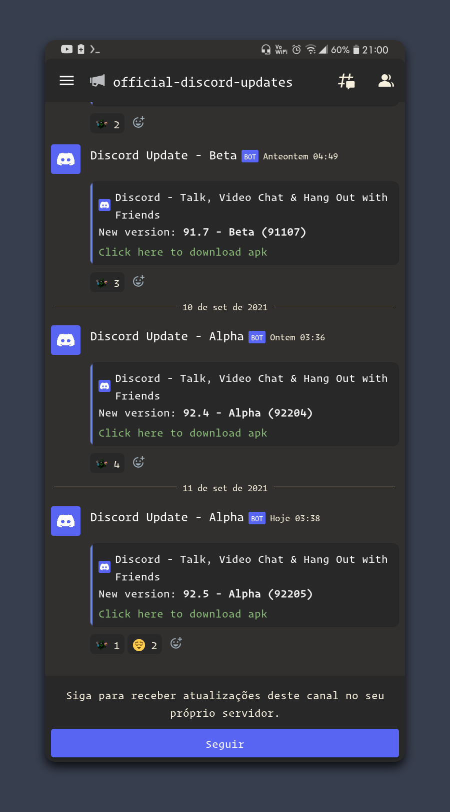

  

# GruvboxCord

Gruvboxcord is a theme for using with Aliucord without root, but you can use it with root.

# Installation

Requirements:
- Aliucord
- Aliucord Themer Plugin or the Xposed module

1. Download the theme .json from Github;
2. Acess Aliucord and import the theme with the plugin, or mannually put the .json on themes folder on Aliucord

# Screenshots

# TODO

- Light version;
- Add more colors.
